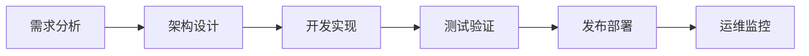

# Mini Apps 开发指南

## 开发流程概述

### 1. 开发生命周期


### 2. 开发环境准备
- 配置开发工具
- 设置调试环境
- 准备测试账号

## 应用架构

### 1. 基础架构
```
src/
├── components/       # UI组件
│   ├── common/      # 通用组件
│   └── specific/    # 特定功能组件
├── pages/           # 页面组件
├── services/        # 业务服务
├── utils/           # 工具函数
├── hooks/           # 自定义Hooks
├── assets/          # 静态资源
└── config/          # 配置文件
```

### 2. 状态管理
```javascript
// 使用World提供的状态管理
import { createStore } from '@world/minikit';

const store = createStore({
  state: {
    user: null,
    settings: {},
    data: []
  },
  actions: {
    updateUser(state, user) {
      state.user = user;
    },
    updateSettings(state, settings) {
      state.settings = { ...state.settings, ...settings };
    }
  }
});
```

## 核心功能开发

### 1. 用户认证
```javascript
// services/auth.js
import { WorldAuth } from '@world/minikit';

export class AuthService {
  constructor() {
    this.auth = new WorldAuth();
  }

  async login() {
    try {
      const result = await this.auth.login();
      return result.user;
    } catch (error) {
      console.error('登录失败:', error);
      throw error;
    }
  }

  async verifyIdentity() {
    try {
      const proof = await this.auth.requestProof({
        type: 'identity',
        action: 'verify'
      });
      return proof;
    } catch (error) {
      console.error('身份验证失败:', error);
      throw error;
    }
  }
}
```

### 2. 支付集成
```javascript
// services/payment.js
import { WorldPayment } from '@world/minikit';

export class PaymentService {
  constructor() {
    this.payment = new WorldPayment();
  }

  async createPayment(amount, currency = 'USDC') {
    try {
      const payment = await this.payment.create({
        amount,
        currency,
        description: '商品购买'
      });
      return payment;
    } catch (error) {
      console.error('支付创建失败:', error);
      throw error;
    }
  }

  async processRefund(paymentId) {
    try {
      const refund = await this.payment.refund(paymentId);
      return refund;
    } catch (error) {
      console.error('退款失败:', error);
      throw error;
    }
  }
}
```

### 3. 数据存储
```javascript
// services/storage.js
import { WorldStorage } from '@world/minikit';

export class StorageService {
  constructor() {
    this.storage = new WorldStorage();
  }

  async saveData(key, data) {
    try {
      await this.storage.set(key, data);
    } catch (error) {
      console.error('数据保存失败:', error);
      throw error;
    }
  }

  async getData(key) {
    try {
      const data = await this.storage.get(key);
      return data;
    } catch (error) {
      console.error('数据获取失败:', error);
      throw error;
    }
  }
}
```

## UI开发

### 1. 组件开发
```javascript
// components/common/Button.js
import { WorldUI } from '@world/minikit-ui';

export const Button = ({ 
  children, 
  onClick, 
  variant = 'primary',
  size = 'medium',
  disabled = false 
}) => {
  return (
    <WorldUI.Button
      variant={variant}
      size={size}
      disabled={disabled}
      onClick={onClick}
    >
      {children}
    </WorldUI.Button>
  );
};
```

### 2. 页面布局
```javascript
// components/Layout.js
import { WorldUI } from '@world/minikit-ui';

export const Layout = ({ children }) => {
  return (
    <WorldUI.Layout>
      <WorldUI.Header>
        <WorldUI.Logo />
        <WorldUI.Navigation />
      </WorldUI.Header>
      
      <WorldUI.Content>
        {children}
      </WorldUI.Content>
      
      <WorldUI.Footer>
        <WorldUI.Copyright />
      </WorldUI.Footer>
    </WorldUI.Layout>
  );
};
```

## 性能优化

### 1. 代码分割
```javascript
// 使用动态导入
const HomePage = React.lazy(() => import('./pages/Home'));
const ProfilePage = React.lazy(() => import('./pages/Profile'));

function App() {
  return (
    <React.Suspense fallback={<Loading />}>
      <Router>
        <Route path="/" element={<HomePage />} />
        <Route path="/profile" element={<ProfilePage />} />
      </Router>
    </React.Suspense>
  );
}
```

### 2. 缓存策略
```javascript
// services/cache.js
export class CacheService {
  constructor() {
    this.cache = new Map();
  }

  set(key, value, ttl = 3600) {
    const item = {
      value,
      timestamp: Date.now(),
      ttl: ttl * 1000
    };
    this.cache.set(key, item);
  }

  get(key) {
    const item = this.cache.get(key);
    if (!item) return null;

    if (Date.now() - item.timestamp > item.ttl) {
      this.cache.delete(key);
      return null;
    }

    return item.value;
  }
}
```

## 错误处理

### 1. 全局错误处理
```javascript
// utils/errorHandler.js
export class ErrorHandler {
  static handle(error) {
    if (error.code === 'AUTH_FAILED') {
      // 处理认证错误
      return this.handleAuthError(error);
    }
    
    if (error.code === 'NETWORK_ERROR') {
      // 处理网络错误
      return this.handleNetworkError(error);
    }
    
    // 处理其他错误
    console.error('未处理的错误:', error);
    throw error;
  }

  static handleAuthError(error) {
    // 实现认证错误处理逻辑
  }

  static handleNetworkError(error) {
    // 实现网络错误处理逻辑
  }
}
```

### 2. 组件错误边界
```javascript
// components/ErrorBoundary.js
class ErrorBoundary extends React.Component {
  constructor(props) {
    super(props);
    this.state = { hasError: false };
  }

  static getDerivedStateFromError(error) {
    return { hasError: true };
  }

  componentDidCatch(error, errorInfo) {
    console.error('组件错误:', error, errorInfo);
  }

  render() {
    if (this.state.hasError) {
      return <h1>出现错误，请稍后重试</h1>;
    }

    return this.props.children;
  }
}
```

## 测试

### 1. 单元测试
```javascript
// __tests__/auth.test.js
import { AuthService } from '../services/auth';

describe('AuthService', () => {
  let authService;

  beforeEach(() => {
    authService = new AuthService();
  });

  test('login should return user data', async () => {
    const user = await authService.login();
    expect(user).toBeDefined();
    expect(user.id).toBeDefined();
  });

  test('verifyIdentity should return proof', async () => {
    const proof = await authService.verifyIdentity();
    expect(proof).toBeDefined();
    expect(proof.valid).toBe(true);
  });
});
```

### 2. 集成测试
```javascript
// __tests__/integration/payment.test.js
import { PaymentService } from '../services/payment';

describe('PaymentService Integration', () => {
  let paymentService;

  beforeEach(() => {
    paymentService = new PaymentService();
  });

  test('complete payment flow', async () => {
    // 创建支付
    const payment = await paymentService.createPayment(100, 'USDC');
    expect(payment.status).toBe('created');

    // 处理支付
    const result = await paymentService.processPayment(payment.id);
    expect(result.status).toBe('completed');

    // 验证支付
    const verification = await paymentService.verifyPayment(payment.id);
    expect(verification.valid).toBe(true);
  });
});
```

## 安全最佳实践

### 1. 数据验证
```javascript
// utils/validator.js
export class Validator {
  static validateInput(data, schema) {
    // 实现输入验证逻辑
  }

  static sanitizeOutput(data) {
    // 实现输出清理逻辑
  }
}
```

### 2. 加密处理
```javascript
// utils/crypto.js
export class Crypto {
  static async encrypt(data, key) {
    // 实现加密逻辑
  }

  static async decrypt(data, key) {
    // 实现解密逻辑
  }
}
```

## 发布流程

### 1. 构建优化
```javascript
// build.config.js
module.exports = {
  optimization: {
    minimize: true,
    splitChunks: {
      chunks: 'all'
    }
  },
  performance: {
    hints: 'warning',
    maxEntrypointSize: 512000,
    maxAssetSize: 512000
  }
};
```

### 2. 部署配置
```javascript
// deploy.config.js
module.exports = {
  production: {
    url: 'https://production.world.org',
    apiKey: process.env.WORLD_API_KEY,
    deploymentKey: process.env.DEPLOYMENT_KEY
  },
  staging: {
    url: 'https://staging.world.org',
    apiKey: process.env.WORLD_API_KEY_STAGING,
    deploymentKey: process.env.DEPLOYMENT_KEY_STAGING
  }
};
```

## 监控和分析

### 1. 性能监控
```javascript
// services/monitoring.js
export class MonitoringService {
  static trackPerformance(metric) {
    // 实现性能追踪逻辑
  }

  static reportError(error) {
    // 实现错误报告逻辑
  }
}
```

### 2. 用户分析
```javascript
// services/analytics.js
export class AnalyticsService {
  static trackEvent(eventName, data) {
    // 实现事件追踪逻辑
  }

  static trackUserBehavior(behavior) {
    // 实现用户行为追踪逻辑
  }
}
```

## 最佳实践总结

1. 代码组织
   - 遵循模块化原则
   - 使用清晰的目录结构
   - 保持代码简洁可维护

2. 性能优化
   - 实施代码分割
   - 优化资源加载
   - 使用适当的缓存策略

3. 安全考虑
   - 实施数据验证
   - 使用适当的加密
   - 遵循安全最佳实践

4. 测试策略
   - 编写完整的测试用例
   - 进行集成测试
   - 实施自动化测试

5. 发布流程
   - 优化构建过程
   - 实施自动化部署
   - 监控应用性能

## 下一步
- 查看[API参考](./api-reference.md)
- 了解[高级特性](./advanced-features.md)
- 探索[示例项目](./example-projects.md)
