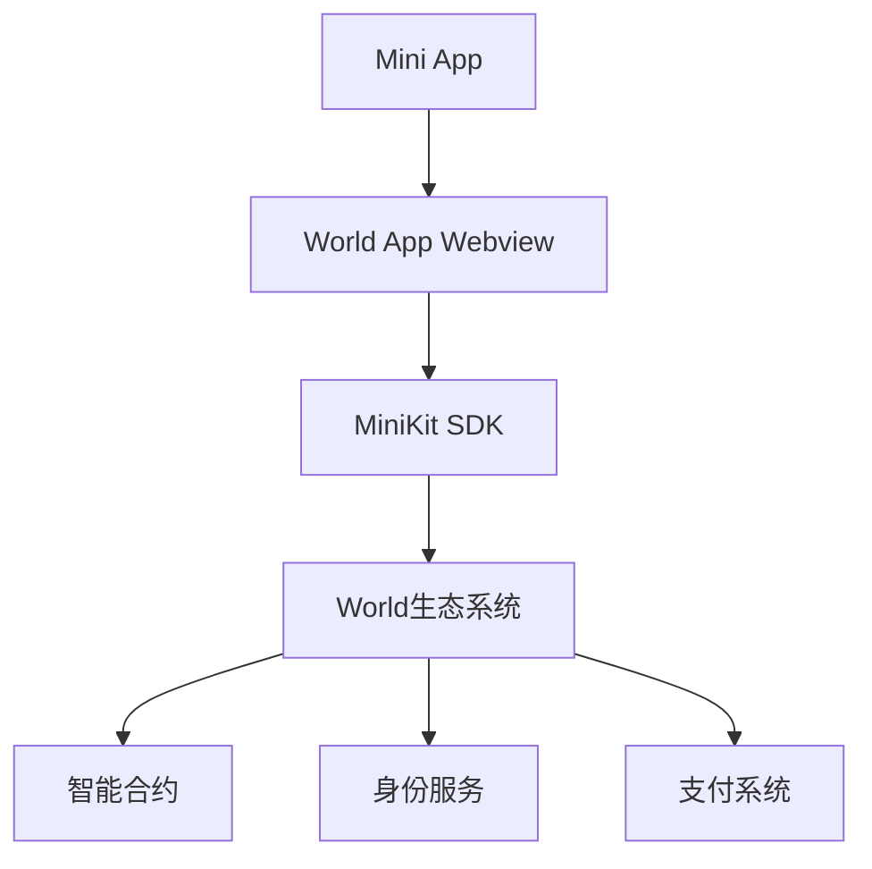

# Mini Apps 介绍

## 什么是Mini Apps？
Mini Apps是在World App生态系统中运行的轻量级应用程序。它们提供了以下核心优势：
- 原生应用般的用户体验
- 与World生态系统的深度集成
- 通过WLD和USDC实现网络效应和变现机会
- 原生支持智能合约功能

## 工作原理
Mini apps本质上是通过World App内的webview打开的Web应用程序。通过使用MiniKit SDK，这些应用程序可以：
- 实现类原生的体验
- 与World生态系统进行交互
- 访问原生功能和API

## 核心功能
1. 原生集成
   - 无缝的用户体验
   - 原生UI组件
   - 性能优化

2. 生态系统接入
   - World ID身份验证
   - 支付集成
   - 智能合约支持

3. 开发工具
   - MiniKit SDK
   - 开发者控制台
   - 调试工具

## 应用场景
1. 金融应用
   - 支付服务
   - 资产管理
   - 交易平台

2. 社交应用
   - 社区平台
   - 消息服务
   - 内容分享

3. 工具类应用
   - 生产力工具
   - 数据管理
   - 实用工具

## 技术架构

## 安全考虑
1. 数据安全
   - 加密传输
   - 安全存储
   - 访问控制

2. 用户隐私
   - 数据最小化
   - 用户授权
   - 隐私保护

3. 合规要求
   - 监管合规
   - 数据保护
   - 审计支持

## 下一步
- [快速开始指南](./quick-start.md)
- [安装说明](./installation.md)
- [开发指南](./development-guide.md)
- [API参考](./api-reference.md)
