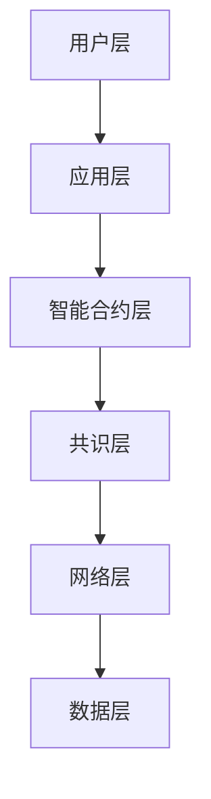

# World Chain 概述

## 什么是World Chain？

World Chain是一个专为人类设计的区块链网络，作为World生态系统的核心基础设施，它将身份验证、金融服务和去中心化应用完美结合。World Chain的目标是构建世界上最大的身份和金融网络，作为一个公共基础设施，将所有权赋予每个人。

### 核心特性

1. 人性化设计
   - 基于人类身份的共识机制
   - 用户友好的交互体验
   - 直观的开发接口

2. 高性能架构
   - 快速交易确认
   - 可扩展的网络结构
   - 高效的资源利用

3. 安全保障
   - 基于World ID的身份验证
   - 多层安全架构
   - 防篡改机制

## 技术架构

### 1. 网络层次


### 2. 核心组件

#### 共识机制
- Proof of Person (PoP)
- 基于人类身份的验证
- 环保高效的区块生产

#### 智能合约
- 支持多种编程语言
- 完整的开发工具链
- 丰富的合约模板

#### 存储系统
- 分布式数据存储
- 高效的检索机制
- 安全的数据保护

## 应用场景

### 1. 金融服务
- 去中心化支付
- 资产管理
- 跨境转账

### 2. 身份验证
- 用户认证
- 权限管理
- 访问控制

### 3. 智能合约
- 自动化执行
- 业务逻辑
- 资产托管

## 开发指南

### 1. 环境准备
```bash
# 安装World Chain CLI
npm install -g @world-chain/cli

# 创建新项目
world-chain init my-project

# 启动本地节点
world-chain node start
```

### 2. 智能合约开发
```solidity
// 示例智能合约
pragma solidity ^0.8.0;

contract WorldApp {
    // 状态变量
    mapping(address => bool) public verifiedUsers;
    
    // 事件
    event UserVerified(address user);
    
    // 验证用户
    function verifyUser(bytes memory proof) public {
        require(WorldID.verify(proof), "Invalid proof");
        verifiedUsers[msg.sender] = true;
        emit UserVerified(msg.sender);
    }
}
```

### 3. 与World ID集成
```javascript
// 集成World ID验证
async function verifyIdentity() {
    const worldID = new WorldID({
        appId: 'your-app-id',
        actionId: 'verify_user'
    });
    
    try {
        const proof = await worldID.verify();
        // 调用智能合约
        await contract.verifyUser(proof);
    } catch (error) {
        console.error('验证失败:', error);
    }
}
```

## 网络参数

### 1. 主网配置
```javascript
const mainnetConfig = {
    chainId: '1',
    networkName: 'World Chain Mainnet',
    rpcUrl: 'https://rpc.worldchain.org',
    explorerUrl: 'https://explorer.worldchain.org'
};
```

### 2. 测试网配置
```javascript
const testnetConfig = {
    chainId: '2',
    networkName: 'World Chain Testnet',
    rpcUrl: 'https://testnet-rpc.worldchain.org',
    explorerUrl: 'https://testnet-explorer.worldchain.org'
};
```

## 性能特性

### 1. 交易处理
- 高吞吐量
- 低延迟
- 可预测的费用

### 2. 扩展性
- 分片技术
- 状态通道
- Layer 2解决方案

### 3. 互操作性
- 跨链通信
- 资产桥接
- 协议兼容

## 安全特性

### 1. 共识安全
- 基于身份的验证
- 多重签名支持
- 防双重支付

### 2. 网络安全
- 节点认证
- 加密通信
- DDoS防护

### 3. 智能合约安全
- 形式化验证
- 安全审计
- 自动化测试

## 开发工具

### 1. CLI工具
```bash
# 创建项目
world-chain create-project

# 部署合约
world-chain deploy

# 测试网络
world-chain test
```

### 2. SDK
```javascript
// 初始化SDK
const worldChain = new WorldChain({
    network: 'mainnet',
    provider: window.ethereum
});

// 连接钱包
await worldChain.connect();

// 发送交易
const tx = await worldChain.sendTransaction({
    to: recipient,
    value: amount
});
```

### 3. 开发框架
- 智能合约框架
- 测试框架
- 部署工具

## 最佳实践

### 1. 开发建议
- 遵循安全准则
- 优化合约代码
- 实施完整测试

### 2. 部署流程
- 本地测试
- 测试网验证
- 主网部署

### 3. 监控维护
- 性能监控
- 错误处理
- 升级管理

## 路线图

### 第一阶段
- 测试网启动
- 基础设施部署
- 开发工具发布

### 第二阶段
- 主网上线
- 生态系统扩展
- 应用集成

### 第三阶段
- 高级功能
- 性能优化
- 生态建设

## 参与贡献

### 1. 开发参与
- 代码贡献
- 文档完善
- 测试反馈

### 2. 社区参与
- 技术讨论
- 提案投票
- 生态建设

## 资源链接

- [官方网站](https://worldchain.org)
- [开发者门户](https://developers.worldchain.org)
- [GitHub仓库](https://github.com/worldcoin/worldchain)
- [技术文档](https://docs.worldchain.org)

## 下一步
- 查看[快速开始指南](./quick-start.md)
- 了解[API参考](./api-reference.md)
- 探索[示例项目](./example-projects.md)
