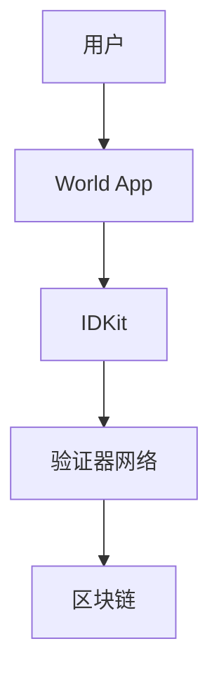

# World ID 开发指南

## 最新公告：World ID 2.0

World ID已升级到2.0版本，带来了新的特性和改进。如果你正在使用旧版本，请查看迁移指南以升级到新版本。

## 什么是World ID？

World ID是世界上最大的去中心化身份和金融网络，作为公共基础设施，将所有权赋予每个人。它提供了一种安全、私密的方式来证明用户是真实的人类。

### 核心特性

1. 去中心化身份验证
   - 基于零知识证明
   - 保护用户隐私
   - 防止机器人和重复账户

2. 人性证明
   - 验证真实人类身份
   - 防止身份欺诈
   - 保护用户数据

3. 安全性
   - 加密保护
   - 不可转让的凭证
   - 防篡改机制

## 技术架构

### 1. 系统组件


### 2. 验证流程
```javascript
// 初始化World ID
const worldID = new WorldID({
    appId: 'your-app-id',
    version: '2.0',
    actionId: 'your-action-id'
});

// 验证流程
async function verifyIdentity() {
    try {
        const result = await worldID.verify({
            signal: 'user_verification',
            proofType: 'orb'  // 或 'device'
        });
        
        if (result.valid) {
            // 验证成功
            console.log('用户验证成功');
        }
    } catch (error) {
        console.error('验证失败:', error);
    }
}
```

## 快速开始

### 1. 安装
```bash
# 使用npm
npm install @worldcoin/idkit

# 使用yarn
yarn add @worldcoin/idkit
```

### 2. 基础配置
```javascript
// 配置World ID
const config = {
    appId: process.env.WORLD_APP_ID,
    actionId: 'verify_user',
    signal: 'user_login',
    enableTelemetry: false,  // 可选，默认为true
    debug: process.env.NODE_ENV !== 'production'  // 开发环境启用调试
};
```

### 3. 集成验证
```javascript
import { WorldIDWidget } from '@worldcoin/idkit';

function App() {
    const onSuccess = (result) => {
        console.log('验证成功:', result);
    };
    
    const onError = (error) => {
        console.error('验证失败:', error);
    };
    
    return (
        <WorldIDWidget
            actionId="verify_user"
            signal="user_login"
            onSuccess={onSuccess}
            onError={onError}
            enableTelemetry={false}
        />
    );
}
```

## 高级功能

### 1. 自定义验证
```javascript
class CustomVerification {
    constructor(worldID) {
        this.worldID = worldID;
    }
    
    async verifyWithCustomRules(proof, rules) {
        // 验证基本证明
        const baseResult = await this.worldID.verify(proof);
        
        // 应用自定义规则
        const customResult = await this.applyCustomRules(
            baseResult,
            rules
        );
        
        return customResult;
    }
    
    async applyCustomRules(result, rules) {
        // 实现自定义验证逻辑
        return rules.every(rule => this.checkRule(result, rule));
    }
}
```

### 2. 批量验证
```javascript
class BatchVerifier {
    async verifyMultiple(proofs) {
        const results = await Promise.all(
            proofs.map(proof => this.worldID.verify(proof))
        );
        
        return {
            success: results.every(r => r.valid),
            results: results
        };
    }
}
```

## 安全考虑

### 1. 防重放攻击
```javascript
class ReplayProtection {
    constructor() {
        this.usedNullifiers = new Set();
    }
    
    async checkNullifier(nullifier) {
        if (this.usedNullifiers.has(nullifier)) {
            throw new Error('Nullifier already used');
        }
        
        this.usedNullifiers.add(nullifier);
    }
}
```

### 2. 数据保护
```javascript
class DataProtection {
    async protectUserData(data) {
        // 实现数据加密
        const encrypted = await this.encrypt(data);
        
        // 安全存储
        await this.secureStore(encrypted);
    }
    
    async verifyDataIntegrity(data) {
        // 实现完整性检查
        return await this.checkIntegrity(data);
    }
}
```

## 性能优化

### 1. 缓存策略
```javascript
class VerificationCache {
    constructor() {
        this.cache = new Map();
    }
    
    async getCachedResult(key) {
        if (this.cache.has(key)) {
            const { result, timestamp } = this.cache.get(key);
            if (this.isValid(timestamp)) {
                return result;
            }
        }
        return null;
    }
    
    async cacheResult(key, result) {
        this.cache.set(key, {
            result,
            timestamp: Date.now()
        });
    }
}
```

### 2. 并发处理
```javascript
class ConcurrentVerifier {
    constructor(maxConcurrent = 5) {
        this.queue = new Queue({
            concurrency: maxConcurrent
        });
    }
    
    async addToQueue(verification) {
        return this.queue.add(() => this.processVerification(verification));
    }
}
```

## 错误处理

### 1. 错误类型
```javascript
const ErrorTypes = {
    INVALID_PROOF: 'INVALID_PROOF',
    EXPIRED_PROOF: 'EXPIRED_PROOF',
    NETWORK_ERROR: 'NETWORK_ERROR',
    VERIFICATION_FAILED: 'VERIFICATION_FAILED'
};

class WorldIDError extends Error {
    constructor(type, message) {
        super(message);
        this.type = type;
    }
}
```

### 2. 错误处理策略
```javascript
class ErrorHandler {
    async handleError(error) {
        switch (error.type) {
            case ErrorTypes.INVALID_PROOF:
                return await this.handleInvalidProof(error);
            case ErrorTypes.EXPIRED_PROOF:
                return await this.handleExpiredProof(error);
            case ErrorTypes.NETWORK_ERROR:
                return await this.handleNetworkError(error);
            default:
                return await this.handleUnknownError(error);
        }
    }
}
```

## 监控和分析

### 1. 性能监控
```javascript
class PerformanceMonitor {
    constructor() {
        this.metrics = new Metrics();
    }
    
    async trackVerification(verification) {
        const startTime = performance.now();
        
        try {
            const result = await verification();
            
            this.metrics.record({
                type: 'verification',
                duration: performance.now() - startTime,
                success: true
            });
            
            return result;
        } catch (error) {
            this.metrics.record({
                type: 'verification',
                duration: performance.now() - startTime,
                success: false,
                error: error.message
            });
            
            throw error;
        }
    }
}
```

### 2. 使用分析
```javascript
class UsageAnalytics {
    trackEvent(event) {
        // 记录使用事件
        analytics.track({
            event: event.type,
            properties: {
                timestamp: Date.now(),
                ...event.data
            }
        });
    }
    
    generateReport() {
        // 生成使用报告
        return analytics.generateReport();
    }
}
```

## 最佳实践

1. 安全性
   - 始终验证proof的有效性
   - 实施重放攻击保护
   - 安全存储敏感数据

2. 性能
   - 实施适当的缓存策略
   - 优化验证流程
   - 监控性能指标

3. 用户体验
   - 提供清晰的错误信息
   - 实现平滑的验证流程
   - 优化加载时间

4. 维护
   - 定期更新依赖
   - 监控系统健康状况
   - 保持文档更新

## 下一步
- 查看[API参考](./api-reference.md)
- 了解[高级特性](./advanced-features.md)
- 探索[示例项目](./example-projects.md)
